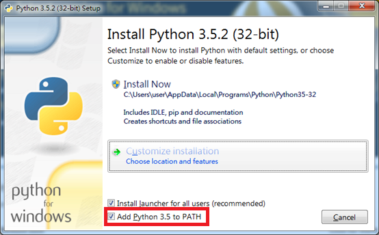
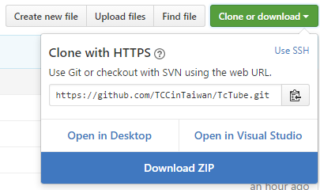

# [:octocat:TcTube](https://github.com/TCCinTaiwan/TcTube)
[](https://github.com/TCCinTaiwan/TcTube/releases) [](https://gitter.im/TCCinTaiwan/TcTube?utm_source=badge&utm_medium=badge&utm_campaign=pr-badge) [](https://travis-ci.org/TCCinTaiwan/TcTube)
[]()

## Contents[↶](#)
* **[Introduction](#introduction)**
* **[Browser Support](#browser-support)**
* **[Installation](#installation)**
* **[Usage](#usage)**
* **[Todo](#todo)**
* **[Contributing](#contributing)**
* **[Coding Style](#coding-style)**
    - **[javascript](#javascript)**
* **[History](#history)**
* **[License](#license)**

## Introduction[↶](#)
這是2016年暑假，我在系上實習，老師叫我們做的系統，我用去年寫的播放器加以改進。
最新版本為0.2.8。


## Browser Support[↶](#)
|  |  |  |  |  | 
| --- | --- | --- | --- | --- | --- |
| IE 9+ ✔ | Chrome ✔ | Firefox ✔ | Opera 37.0+ ✔ | Safari 4.0+ ✖ |  Vivaldi 1+ ✔ |

## Installation[↶](#)
### Base Server
* Git:
[ ](https://git-scm.com/download/)

* Python:
[ ](https://www.python.org/downloads/)

>要勾"Add Python to PATH"，把Python加到環境變數中。

1. Clone the repository

    Use command:

    ```bash
    git clone https://github.com/TCCinTaiwan/TcTube
    ```

    Or:

    [ ](https://github.com/TCCinTaiwan/TcTube/archive/master.zip)

2. Install requirement python module

    You can use pip:

    ```bash
    pip install -r TcTube/requirements.txt
    ```

    Or you can run [setup.py](setup.py) :

    ```bash
    python setup.py install
    ```

### Media Server
* Nginx:
[ ](https://nginx.org/en/download.html)

1. 下載nginx後，把檔案放在TcTube底下，或者修改 [main.py](main.py) 中nginx路徑。
>最好下載最新的穩定版本(Stable version)

2. 把 [setup/nginx.conf](nginx.conf)複製到 nginx-*/conf/ 底下，取代原本的 nginx.conf。
3. 音樂檔案要放在 [media/video/](media/video/)
4. 修改 [database.db](database.db)裡的videos和videoSources資料表，加入自己的歌

```sql
insert  into videos (title, artist) values ("<title>", "<artist>");
insert into videoSources (id, video_id, source) values (1, <video_id>, "<filename>");
insert into videoSources (id, video_id, source) values (2, <video_id>, "<filename2>");
...
```

## Usage[↶](#)
* run Server:
```bash
# Go into the directory
cd TcTube

# run server
python main.py
```

## Todo[↶](#)
1. 資料庫:
    - 部門
        + select users.id, users.account, users.password, users.name , users.affiliation, department.name as affiliation_name, users.email, users.phone, users.birthday, users.creating_time, users.login_time, users.login_ip, users.competence from users join department on users.affiliation = department.id;
2. 控制面板延遲
3. APP化
4. 頁面歷史
5. 播放清單
6. 影片嵌入支援
    - Vimeo.com
    - 優酷 http://open.youku.com/tools
    - 土豆網
    - 愛奇藝
    - FaceBook https://developers.facebook.com/docs/plugins/embedded-video-player
    - flv
7. 影片預覽
8. SSL
9. 選項:
    - 下載檔名格式
10. 檔案類型分析(不是以副檔名分析)
11. Blob
12. 時間進度Seekable
13. SSO
14. localization:
    - Babel
15. 加入uwsgi
16. 播放器重構
17. Chrome Extensions
18. Youtube跟Video整合:
    - Youtube斷線時使用本地

## Contributing[↶](#)
1. Create an issue and describe your idea
2. Fork it!
3. Create your feature branch: `git checkout -b my-new-feature`
4. Commit your changes: `git commit -m 'Add some feature'`
5. Push to the branch: `git push origin my-new-feature`
6. Submit a Pull Request

## Coding Style[↶](#)
### JavaScript[↶](#)
* No tabs. **Four spaces**.
* No trailing whitespace.
* Always use semicolons and don't rely on implicit insertion.
* use **lowerCamelCase** for identifier names (variables and functions).
    + :white_check_mark: good
    ```javascript
    var helloWorld = "Hello, world."; // lowerCamelCase
    var strHelloWorld = "Hello, world."; // Hungarian Notation + lowerCamelCase
    ```
    + :x: bad
    ```javascript
    var HelloWorld = "Hello, world."; // UpperCamelCase, Pascal
    var helloworld = "Hello, world."; // lowercase
    var HELLOWORLD = "Hello, world."; // UPPERCASE
    var Hello_World = "Hello, world."; // Capitalized_Words_With_Underscores
    var HELLO_WORLD = "Hello, world."; // UPPER_CASE_WITH_UNDERSCORES
    var hello_world = "Hello, world."; // lower_case_with_underscores
    var hello-world = "Hello, world."; // lower-case-hyphens
    var HELLO-WORLD = "Hello, world."; // UPPER-CASE-HYPHENS
    ...
    ```
* **Double quotes**. Single quotes are OK only when nested within double quotes.
    + :white_check_mark: good
    ```javascript
    var foo = "Hello, world.";
    var bar = "Hello, 'world.'";
    ```
    + :x: bad
    ```javascript
    var foo = 'Hello, world.';
    ```
* Functions are followed by no space.
    + :white_check_mark: good
    ```javascript
    function foo() {
        ...
    }
    ```
    + :x: bad
    ```javascript
    function foo () {
        ...
    }
    ```
* Always put spaces around operators (= + - * /), and after commas.
    + :white_check_mark: good
    ```javascript
    var x = y + z;
    var values = ["Apple", "Ball", "Cat"];
    ```
    + :x: bad
    ```javascript
    var x=y+z;
    var values=["Apple","Ball","Cat"];
    ```
* Argument definitions are followed by no spaces.
    + :white_check_mark: good
    ```javascript
    function foo(a, b, c) {
        ...
    }
    ```
    + :x: bad
    ```javascript
    function foo( a, b, c ) {
        ...
    }
    ```
* A **single space** will always and should only follow semi-colons when defining object literals.
    + :white_check_mark: good
    ```javascript
    var foo = {
        bar: 1
    };
    ```
    + :x: bad
    ```javascript
    var foo = {
        bar : 1
    };
    var foo = {
        bar:1
    };
    ```
* A **single space** will always follow conditional statements.
    + :white_check_mark: good
    ```javascript
    if (true) {
       ...
    }
    ```
    + :x: bad
    ```javascript
    if(true) {
       ...
    }
    if(true){
       ...
    }
    ```
* General rules for complex (compound) statements:
    + Put the opening bracket at the end of the first line.
    + Use one space before the opening bracket.
    + Put the closing bracket on a new line, without leading spaces.
    + Do not end a complex statement with a semicolon.
    ```javascript
    function formatTime(seconds) {
        minutes = Math.floor(seconds / 60);
        minutes = (minutes >= 10) ? minutes : "0" + minutes;
        seconds = Math.floor(seconds % 60);
        seconds = (seconds >= 10) ? seconds : "0" + seconds;
        return minutes + ":" + seconds;
    }
    ```

## History[↶](#)
For detailed changelog, check [Change Log](CHANGELOG.md).

## License[↶](#)
[](LICENSE)
